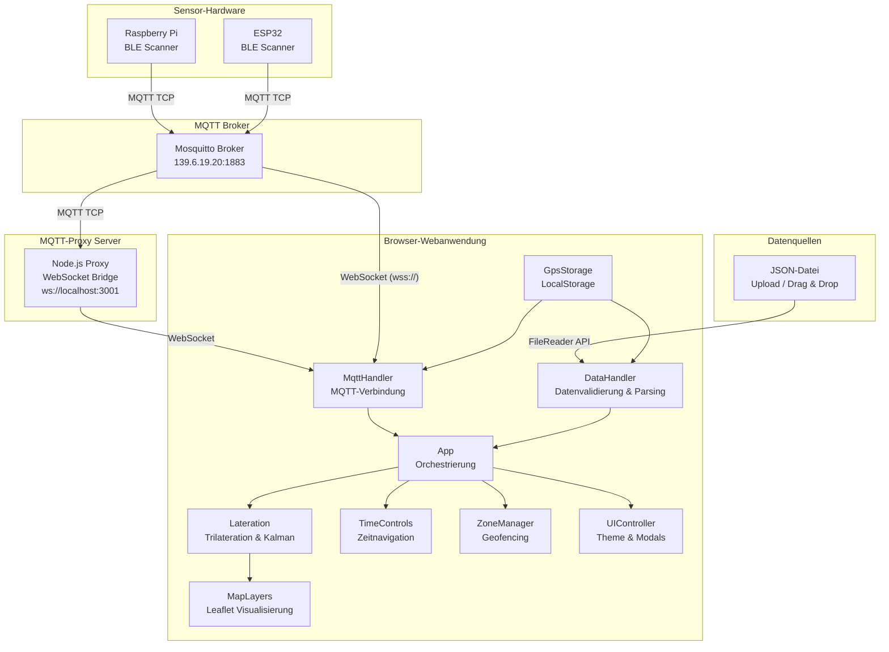
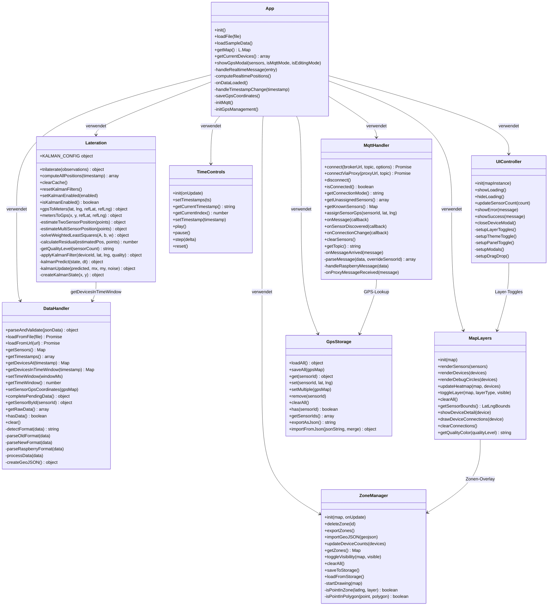
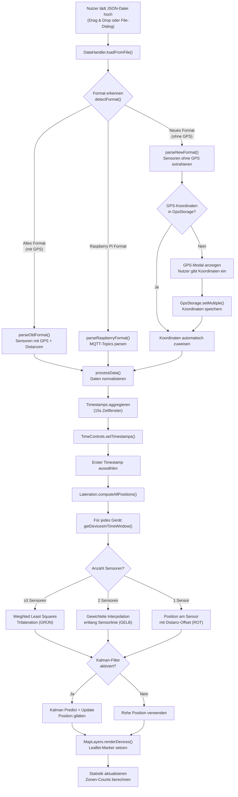
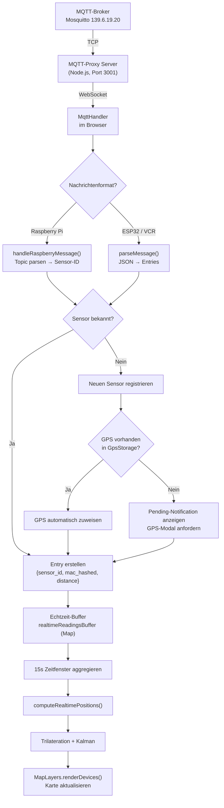
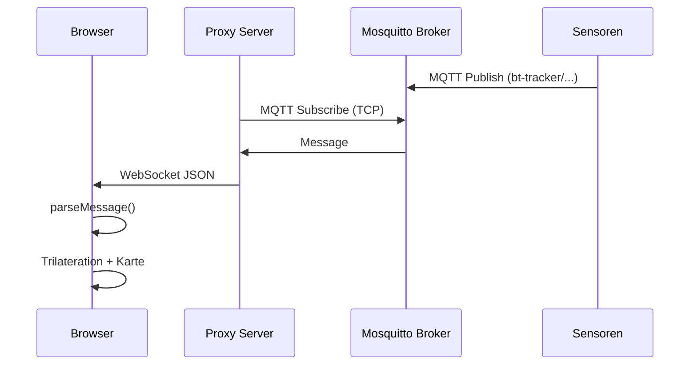

# Projektbericht: Multi-Sensor Bluetooth Device Tracking

**Modul:** Data Processing  
**Semester:** WS 2025/26  
**Team BT Data Processing**

| Teammitglied | Schwerpunkt |
|---|---|
| Omar Samig | Technische Leitung, Lateration & Kalman-Filter, App-Architektur |
| Bilal Al Chami | MQTT-Integration, Proxy-Server, Echtzeit-Datenverarbeitung |
| Soufian El Berkani | Datenformate & Parsing, DataHandler-Modul, JSON-Validierung |
| Abdulkarim Darwish | Kartenvisualisierung, MapLayers, Heatmap, UI/UX-Design |
| Ziad Belhaou | Zonen-Management, GeoJSON Import/Export, GPS-Speicherung |
| Cyntia Pola | Zeitsteuerung, Playback-System, Testing & Dokumentation |

---

## Projekt-Repository & Schnellstart

Das vollständige Projekt ist auf GitHub verfügbar:

> **Repository:** [https://github.com/osamig/smo-tracker](https://github.com/osamig/smo-tracker)

### Projekt herunterladen & starten

```bash
# 1. Repository klonen
git clone https://github.com/osamig/smo-tracker.git
cd smo-tracker

# 2. MQTT-Proxy installieren (nur für Echtzeit-Modus nötig)
cd mqtt-proxy
npm install
npm start

# 3. Webanwendung öffnen
# Öffne index.html im Browser (Doppelklick oder: start index.html)
```

### Testdaten

Im Ordner `test files/` befinden sich aufgezeichnete Daten vom letzten Test mit den Raspberry Pis an der TH Köln:

- **`sensor_gps_coordinates (1).json`** — GPS-Koordinaten der 6 Raspberry-Pi-Sensoren am Campus
- **`converted-1769824729316.json`** — Aufgezeichnete Sensordaten (Distanzmessungen, gehashte MAC-Adressen) vom Live-Test

Zum Testen: `index.html` öffnen → die Datei `converted-1769824729316.json` per Drag & Drop auf die Karte ziehen.

> Für eine ausführliche Anleitung siehe die [README.md](https://github.com/osamig/smo-tracker/blob/main/README.md) im Repository.

---

## Inhaltsverzeichnis

1. Einleitung & Motivation
2. Arbeit in der Gruppe
3. Nachvollziehbare Dokumentation
4. Definition und Auswahl des Entwicklungsprojektes
5. Technisches Konzept
   - 5.1 Systemarchitektur
   - 5.2 Klassendiagramm
   - 5.3 Ablaufdiagramm – Datenverarbeitung
   - 5.4 Ablaufdiagramm – MQTT Echtzeit
   - 5.5 Technologiebausteine
6. Technische Umsetzung
   - 6.1 DataHandler-Modul
   - 6.2 Lateration-Modul (Trilateration & Kalman-Filter)
   - 6.3 MQTT-Handler & Proxy-Server
   - 6.4 Kartenvisualisierung (MapLayers)
   - 6.5 Zonen-Management
   - 6.6 Zeitsteuerung & Playback
   - 6.7 GPS-Speicherung
   - 6.8 UI-Controller
7. Ergebnisse & Fazit
8. Quellenverzeichnis

---

## 1. Einleitung & Motivation

Die zunehmende Digitalisierung öffentlicher und halböffentlicher Räume – wie Hochschulcampus, Einkaufszentren oder Veranstaltungsorte – erfordert intelligente Systeme zur Analyse von Personenströmen und Raumauslastung. Bluetooth-basiertes Tracking bietet hierfür eine datenschutzfreundliche Möglichkeit, da ausschließlich anonymisierte (gehashte) MAC-Adressen verarbeitet werden und keine personenbezogenen Daten erhoben werden.

Unser Projekt **„Multi-Sensor Bluetooth Device Tracking"** realisiert eine webbasierte Plattform, die BLE-Sensordaten (Bluetooth Low Energy) in Echtzeit empfängt, verarbeitet und auf einer interaktiven Karte visualisiert. Durch mathematische Verfahren wie **Trilateration** und **Kalman-Filterung** werden Gerätepositionen aus Distanzmessungen mehrerer Sensoren geschätzt und geglättet dargestellt.

Das System unterstützt sowohl die **Offline-Analyse** historischer Daten (JSON-Import mit Zeitnavigation) als auch den **Echtzeit-Betrieb** über MQTT-Broker, wodurch es flexibel für verschiedene Anwendungsszenarien einsetzbar ist.

**Herausforderung Datenverfügbarkeit:** In der ersten Projektphase standen noch keine realen Sensordaten zur Verfügung, da die Hardware-Infrastruktur (Raspberry Pi, ESP32) erst im Laufe des Semesters aufgebaut wurde. Um die Entwicklung der Software nicht zu blockieren, hat das Team **simulierte Sensordaten** erzeugt und damit die Kernalgorithmen (Trilateration, Kalman-Filter) implementiert und getestet. Erst später kamen reale Daten von den Raspberry-Pi-Sensoren über den MQTT-Broker hinzu. Aus dieser iterativen Entwicklung ergeben sich die **drei verschiedenen Datenformate**, die das System heute unterstützt – jedes Format spiegelt eine Phase der Projektentwicklung wider (simuliert mit GPS → simuliert ohne GPS → reale Raspberry-Pi-Daten).

---

## 2. Arbeit in der Gruppe

### 2.1 Projektmanagement

Das Projekt wurde in einem **agilen Vorgehen** organisiert, angelehnt an Scrum mit wöchentlichen Sprints. Die Kommunikation erfolgte über:

- **Notion** – zentrale Dokumentationsplattform für Aufgaben, Fortschritte und Wissensmanagement
- **WhatsApp/Discord** – tägliche Abstimmung und schnelle Klärung von Fragen
- **Gemeinsame Arbeitssitzungen** – regelmäßige Pair-Programming-Sessions für komplexe Module

### 2.2 Aufgabenteilung

Die Aufgabenverteilung orientierte sich an den Stärken und Interessen der Teammitglieder:

| Teammitglied | Hauptaufgabe | Ergebnis |
|---|---|---|
| **Omar Samig** | Kernalgorithmen & Architektur | `lateration.js`, `app.js` — Trilateration, Kalman-Filter, Modulorchestrierung |
| **Bilal Al Chami** | Echtzeit-Datenanbindung | `mqttHandler.js`, `mqtt-proxy/server.js` — MQTT-WebSocket-Bridge, Proxy-Server |
| **Soufian El Berkani** | Datenverarbeitung & Validierung | `dataHandler.js` — Multi-Format-Parsing, Zeitsynchronisation, Datenvalidierung |
| **Abdulkarim Darwish** | Visualisierung & UI | `mapLayers.js`, `uiController.js`, `styles.css` — Leaflet-Karte, Themes, Modals |
| **Ziad Belhaou** | Zonen & GPS-Verwaltung | `zoneManager.js`, `gpsStorage.js` — GeoJSON, LocalStorage, Zonenanalyse |
| **Cyntia Pola** | Zeitsteuerung & QA | `timeControls.js`, `index.html` — Playback, Testing, Dokumentation |

### 2.3 Gruppendynamik & Tooling

- **Versionskontrolle:** Git mit Feature-Branches pro Modul
- **Code-Reviews:** Gegenseitige Reviews vor dem Merge in den Main-Branch
- **Tooling:** VS Code als gemeinsame IDE, Notion als Wiki, Browser-DevTools für Debugging
- **Konfliktlösung:** Technische Diskussionen wurden in gemeinsamen Sessions gelöst, wobei Prototypen verglichen und die beste Lösung gewählt wurde

---

## 3. Nachvollziehbare Dokumentation

### 3.1 Dokumentation in Notion

Das gesamte Projekt wurde in einem gemeinsamen **Notion-Workspace** dokumentiert:

- **Projektübersicht** mit Zielen, Meilensteinen und Zeitplan
- **Technische Dokumentation** der Algorithmen (Trilateration, Kalman-Filter)
- **Meeting-Protokolle** mit Beschlüssen und Action Items
- **Aufgaben-Board** (Kanban-Style) zur Fortschrittsverfolgung

### 3.2 Dokumentation im Code

Jedes Modul folgt einem einheitlichen Dokumentationsstandard:

```javascript
/**
 * ============================================================
 * [Modulname] Module
 * ============================================================
 * [Beschreibung des Moduls]
 */
```

Alle öffentlichen Funktionen sind mit **JSDoc-Kommentaren** versehen:

```javascript
/**
 * Main lateration function - estimates device position from sensor readings
 * @param {array} observations - Array of { sensor_id, sensor_lat, sensor_lng, distance, rssi }
 * @returns {object} { lat, lng, qualityLevel, sensorCount, confidence }
 */
function trilaterate(observations) { ... }
```

Zusätzlich enthalten die Algorithmen-Module **inline Erklärungen** der mathematischen Formeln:

```javascript
// Linearized approach:
// From (x-x_i)² + (y-y_i)² = d_i², subtract first equation from others
// to get linear system: Ax = b
```

### 3.3 Modulare Struktur

Die Codebasis ist in **9 eigenständige Module** aufgeteilt, die jeweils als **IIFE (Immediately Invoked Function Expression)** mit öffentlicher API implementiert sind. Dies gewährleistet Kapselung, Testbarkeit und klare Schnittstellen.

---

## 4. Definition und Auswahl des Entwicklungsprojektes

### 4.1 Gesellschaftlicher Kontext

Die Analyse von Personenströmen in öffentlichen Räumen gewinnt durch Smart-City-Konzepte, Pandemie-Management und Raumplanung zunehmend an Bedeutung. Klassische Methoden (Kameras, manuelle Zählung) sind entweder datenschutzrechtlich problematisch oder nicht skalierbar.

**Bluetooth-Tracking** bietet eine datenschutzfreundliche Alternative:
- Es werden ausschließlich **anonymisierte (gehashte) MAC-Adressen** verarbeitet
- Keine Identifikation einzelner Personen möglich
- Passives Scannen – keine App-Installation erforderlich
- Kostengünstige Hardware (Raspberry Pi, ESP32)

### 4.2 Anforderungen / User Stories

| ID | User Story | Priorität |
|---|---|---|
| US-01 | Als Nutzer möchte ich Sensordaten als JSON-Datei hochladen, um historische Daten zu analysieren | Hoch |
| US-02 | Als Nutzer möchte ich Echtzeit-Daten über MQTT empfangen, um Live-Tracking durchzuführen | Hoch |
| US-03 | Als Nutzer möchte ich Gerätepositionen auf einer Karte sehen, um Personenströme zu analysieren | Hoch |
| US-04 | Als Nutzer möchte ich die Qualität der Positionsschätzung erkennen (Rot/Gelb/Grün) | Mittel |
| US-05 | Als Nutzer möchte ich Zonen definieren, um die Auslastung bestimmter Bereiche zu messen | Mittel |
| US-06 | Als Nutzer möchte ich durch die Zeitachse navigieren, um den zeitlichen Verlauf zu sehen | Mittel |
| US-07 | Als Nutzer möchte ich GPS-Koordinaten für Sensoren speichern und wiederverwenden | Mittel |
| US-08 | Als Nutzer möchte ich zwischen Dark/Light-Theme wählen | Niedrig |
| US-09 | Als Nutzer möchte ich eine Heatmap-Ansicht nutzen | Niedrig |
| US-10 | Als Nutzer möchte ich den Kalman-Filter ein-/ausschalten können | Niedrig |

### 4.3 Projektabgrenzung & Datenstrategie

Das Projekt konzentriert sich auf die **Datenverarbeitung und Visualisierung**. Die Sensorhardware (Raspberry Pi, ESP32) und der MQTT-Broker werden als extern bereitgestellt betrachtet. Die Anwendung ist als reine **Client-Side-Webanwendung** konzipiert (kein serverseitiges Backend erforderlich, außer dem optionalen MQTT-Proxy).

**Simulierte Daten als Entwicklungsgrundlage:** Da im ersten Monat des Projekts keine realen Sensordaten verfügbar waren, hat das Team eigene Testdaten simuliert. Diese simulierten Datensätze ermöglichten es, die Kernalgorithmen frühzeitig zu entwickeln und zu validieren. Im Verlauf des Projekts kamen schrittweise reale Datenquellen hinzu – zunächst über den VCR-Broker (ESP32-Sensoren), später über den Mosquitto-Broker (Raspberry-Pi-Sensoren). Die drei unterstützten Datenformate (Altes Format mit GPS, Neues Format ohne GPS, Raspberry-Pi-Format) sind ein direktes Ergebnis dieser iterativen Datenstrategie.

---

## 5. Technisches Konzept

### 5.1 Systemarchitektur

Die folgende Übersicht zeigt die Gesamtarchitektur des Systems:



### 5.2 Klassendiagramm (Modul-Diagramm)

Da die Anwendung in JavaScript mit dem **Revealing Module Pattern** (IIFE) implementiert ist, zeigt das folgende Diagramm die Module mit ihren öffentlichen Methoden und Abhängigkeiten:



### 5.3 Ablaufdiagramm – Datenverarbeitung (JSON-Upload)

Das folgende Diagramm zeigt den Ablauf vom JSON-Upload bis zur Kartenvisualisierung:



### 5.4 Ablaufdiagramm – MQTT-Echtzeitdaten



### 5.5 Technologiebausteine

| Technologie | Zweck | Version/Details |
|---|---|---|
| **JavaScript (ES6+)** | Anwendungslogik | Vanilla JS, Module Pattern (IIFE) |
| **HTML5 / CSS3** | Struktur & Styling | Responsive, Dark/Light Theme |
| **Leaflet.js** | Kartenvisualisierung | v1.9.4, OpenStreetMap + CartoDB Tiles |
| **Leaflet.draw** | Zonen-Zeichnung | v1.0.4, Polygon/Rectangle/Circle |
| **Leaflet.heat** | Heatmap-Overlay | v0.2.0 |
| **Paho MQTT** | WebSocket MQTT-Client | v1.0.1 (Browser-seitig) |
| **Node.js** | Proxy-Server | Express + WS + mqtt.js |
| **MQTT (Mosquitto)** | Message Broker | TCP-Protokoll, bt-tracker/# Topic |
| **LocalStorage** | Persistente Speicherung | GPS-Koordinaten, Zonen |
| **GeoJSON** | Datenformat | Import/Export von Zonen |

#### Recherche & Auswahl

Vor der Technologieauswahl wurden mehrere Alternativen evaluiert:

| Entscheidung | Alternativen | Begründung |
|---|---|---|
| Leaflet vs. Google Maps | Google Maps, Mapbox | Leaflet: Open-Source, keine API-Kosten, sehr flexibel |
| Vanilla JS vs. React | React, Vue.js | Kein Build-Tool nötig, geringere Komplexität, direkte Nutzung im Browser |
| MQTT vs. HTTP Polling | REST API, WebSocket-Direkt | MQTT: Industrie-Standard für IoT, Pub/Sub, QoS-Level |
| Kalman vs. Simple Average | Moving Average, Median | Kalman: physikalisches Modell, adaptiv, Geschwindigkeitsschätzung |

---

## 6. Technische Umsetzung

### 6.1 DataHandler-Modul
**Verantwortlich: Soufian El Berkani** — `dataHandler.js`

Der DataHandler ist das zentrale Modul für die Datenaufbereitung. Da im ersten Projektmonat keine realen Sensordaten zur Verfügung standen, wurden zunächst **simulierte Daten** erzeugt. Im Laufe der Entwicklung kamen dann reale Datenquellen hinzu. Aus dieser iterativen Entwicklung entstanden **drei verschiedene Eingabeformate**, die der DataHandler alle automatisch erkennt und verarbeitet:

**1. Altes Format (mit GPS):**
```json
[{
  "sensor_id": "sensor_1",
  "lat": 50.9433,
  "lng": 6.9579,
  "devices": [{
    "mac_hashed": "a1b2c3...",
    "distance": 5.2,
    "rssi": -65,
    "timestamp": "2025-01-15T10:30:00Z"
  }]
}]
```

**2. Neues Format (ohne GPS):**
```json
{
  "sensor_01": [{
    "mac_hashed": "a1b2c3...",
    "distance": 5.2,
    "timestamp": "2025-01-15T10:30:00Z"
  }]
}
```

**3. Raspberry Pi Format:**
```json
{
  "timestamp": "2025-01-15T10:30:00Z",
  "topic": "bt-tracker/raspberry/pi-7/distance",
  "type": "raw",
  "payload": "{\"mac\":\"a1b2c3...\",\"distance\":5.2}"
}
```

#### Zeitsynchronisation (Time-Window-Aggregation)

Ein zentrales Problem bei verteilten Sensoren ist die **asynchrone Datenübertragung**: Sensor A meldet ein Gerät um 12:00:01, Sensor B erst um 12:00:10. Die Funktion `getDevicesInTimeWindow()` löst dieses Problem durch ein konfigurierbares **Zeitfenster** (Standard: 15 Sekunden), innerhalb dessen alle Sensorwerte eines Geräts zusammengefasst werden. Pro Sensor wird nur der **zeitlich nächste Messwert** zum Ziel-Timestamp verwendet, um Duplikate zu vermeiden.

### 6.2 Lateration-Modul (Trilateration & Kalman-Filter)
**Verantwortlich: Omar Samig** — `lateration.js`

#### Trilateration – Mathematische Grundlage

Gegeben sind *N* Sensoren an bekannten Positionen *(x_i, y_i)* mit gemessenen Distanzen *d_i*. Gesucht ist die Position *(x, y)*, die das Gleichungssystem erfüllt:

> **(x − x_i)² + (y − y_i)² = d_i²** für alle *i*

**Fall 1: ≥3 Sensoren (HIGH Quality / Grün)**

Das nichtlineare System wird **linearisiert**, indem die erste Gleichung von allen anderen subtrahiert wird:

> **2·(x_i − x_1)·x + 2·(y_i − y_1)·y = d_1² − d_i² + x_i² − x_1² + y_i² − y_1²**

Dies ergibt ein lineares System **Ax = b**, das mittels **gewichteter kleinster Quadrate** (Weighted Least Squares) gelöst wird:

> **x = (AᵀWA)⁻¹ · AᵀWb**

Die Gewichte *w_i* berücksichtigen sowohl die Distanz (nähere Sensoren sind zuverlässiger) als auch die RSSI-Signalstärke.

**Fall 2: 2 Sensoren (MEDIUM Quality / Gelb)**

Bei nur zwei Sensoren wird die Position entlang der Verbindungslinie interpoliert. Der Parameter *t* bestimmt die Position:

> **t = (D² + d₁² − d₂²) / (2·D²)**

wobei *D* der Abstand zwischen den Sensoren ist. *t = 0* entspricht Sensor 1, *t = 1* entspricht Sensor 2.

**Fall 3: 1 Sensor (LOW Quality / Rot)**

Mit nur einem Sensor ist keine Trilateration möglich. Das Gerät wird in der gemessenen Distanz vom Sensor positioniert, wobei der Winkel deterministisch aus dem MAC-Hash berechnet wird, um konsistente Darstellung zu gewährleisten.

#### Kalman-Filter

Der Kalman-Filter glättet die Positionsschätzungen über die Zeit mittels eines **Constant-Velocity-Modells**:

**Zustandsvektor:** [x, y, vx, vy] (Position + Geschwindigkeit)

**Predict-Schritt:**
```
x_pred = F · x    (Vorhersage basierend auf Bewegungsmodell)
P_pred = F · P · Fᵀ + Q    (Unsicherheit wächst)
```

**Update-Schritt:**
```
K = P_pred · Hᵀ · (H · P_pred · Hᵀ + R)⁻¹    (Kalman-Gain)
x_new = x_pred + K · (z − H · x_pred)           (Korrektur)
P_new = (I − K · H) · P_pred                     (Unsicherheit sinkt)
```

Die Parameter sind konfigurierbar:
- **Process Noise (Q):** 0.5 — Erwartete Positionsänderung zwischen Messungen
- **Measurement Noise (R):** 2.0 — Rauschpegel der Trilaterationsmessungen

#### GPS-Koordinatenumrechnung

Für die lokale Berechnung werden GPS-Koordinaten mittels **äquirektangulärer Projektion** in ein metrisches Koordinatensystem umgerechnet:

```javascript
x = (lng − refLng) · π/180 · R · cos(refLat)
y = (lat − refLat) · π/180 · R
```

Diese Näherung ist für kleine Gebiete (< 10 km) ausreichend genau.

### 6.3 MQTT-Handler & Proxy-Server
**Verantwortlich: Bilal Al Chami** — `mqttHandler.js` + `mqtt-proxy/server.js`

#### Architektur der MQTT-Anbindung

Da Browser nur **WebSocket-Verbindungen** unterstützen, wurde ein zweistufiges Konzept implementiert:

**Modus 1: Direkte WebSocket-Verbindung**
- Für Broker mit WebSocket-Unterstützung (z.B. `wss://test.mosquitto.org:8081/mqtt`)
- Nutzt die Paho MQTT JavaScript-Bibliothek

**Modus 2: Proxy-Server (VCR Broker)**
- Node.js-Server als Bridge zwischen TCP-MQTT und WebSocket
- Verbindet sich zum Mosquitto-Broker (`mqtt://139.6.19.20:1883`)
- Stellt WebSocket-Endpunkt unter `ws://localhost:3001` bereit
- Unterstützt dynamische Topic-Wechsel über Client-Commands



#### Sensor-Discovery

Wenn ein neuer Sensor erkannt wird, prüft der Handler automatisch den `GpsStorage`. Sind GPS-Koordinaten vorhanden, werden sie automatisch zugewiesen. Andernfalls wird der Nutzer über ein Modal zur Eingabe aufgefordert. Dies ermöglicht einen **reibungslosen Echtzeit-Start** ohne manuelle Konfiguration bei bekannten Sensoren.

### 6.4 Kartenvisualisierung (MapLayers)
**Verantwortlich: Abdulkarim Darwish** — `mapLayers.js` + `styles.css`

#### Leaflet-Integration

Die Kartenvisualisierung basiert auf **Leaflet.js** mit CartoDB-Tiles (Dark/Light):

- **Sensor-Layer:** Blaue Kreismarker mit Tooltip (Sensor-ID, GPS)
- **Device-Layer:** Farbcodierte Marker nach Qualitätsstufe:
  - 🟢 Grün: ≥3 Sensoren (High Quality)
  - 🟡 Gelb: 2 Sensoren (Medium Quality)
  - 🔴 Rot: 1 Sensor (Low Quality)
- **Debug-Layer:** Distanzkreise um Sensoren, Verbindungslinien zum Gerät
- **Heatmap-Layer:** Leaflet.heat für Dichteanzeige
- **Zonen-Layer:** GeoJSON-Polygone mit Device-Count

#### Responsive Design

Das UI ist vollständig responsive mit CSS Custom Properties (Design Tokens):
- Dark Theme (Standard) und Light Theme
- Minimierbares Control Panel
- Modal-Dialoge für Detailansichten und GPS-Eingabe
- Drag-and-Drop für Datei-Upload

### 6.5 Zonen-Management
**Verantwortlich: Ziad Belhaou** — `zoneManager.js` + `gpsStorage.js`

#### Geofencing

Zonen werden mit **Leaflet.draw** als Polygone, Rechtecke oder Kreise auf der Karte gezeichnet. Für jede Zone wird in Echtzeit gezählt, wie viele Geräte sich darin befinden. Die Zuordnung erfolgt über den **Ray-Casting-Algorithmus** (Point-in-Polygon):

```javascript
function isPointInPolygon(point, polygon) {
    let inside = false;
    for (let i = 0, j = polygon.length - 1; i < polygon.length; j = i++) {
        if ((polygon[i].lat > point.lat) !== (polygon[j].lat > point.lat) &&
            point.lng < (polygon[j].lng - polygon[i].lng) * 
            (point.lat - polygon[i].lat) / (polygon[j].lat - polygon[i].lat) + 
            polygon[i].lng) {
            inside = !inside;
        }
    }
    return inside;
}
```

#### Persistenz

Zonen und GPS-Koordinaten werden im **LocalStorage** gespeichert und können als **GeoJSON exportiert/importiert** werden. Dies ermöglicht die Wiederverwendung von Konfigurationen zwischen Sessions.

### 6.6 Zeitsteuerung & Playback
**Verantwortlich: Cyntia Pola** — `timeControls.js`

Das Zeitsteuerungsmodul ermöglicht die **Navigation durch historische Daten**:

- **Slider:** Direkte Auswahl eines Timestamps
- **Play/Pause:** Automatisches Abspielen mit `requestAnimationFrame`
- **Geschwindigkeit:** 0.5x, 1x, 2x, 4x
- **Vor/Zurück:** Schrittweises Navigieren

Bei jeder Timestamp-Änderung wird die Trilateration neu berechnet und die Karte aktualisiert. Durch den **Result-Cache** im Lateration-Modul werden bereits berechnete Positionen wiederverwendet.

### 6.7 GPS-Speicherung
**Verantwortlich: Ziad Belhaou** — `gpsStorage.js`

Das Modul verwaltet GPS-Koordinaten für Sensoren persistent im **LocalStorage**:

- **CRUD-Operationen:** `get()`, `set()`, `setMultiple()`, `remove()`, `clearAll()`
- **Import/Export:** JSON-basiert, mit optionalem Merge-Modus
- **Validierung:** Prüfung auf gültige `lat`/`lng`-Werte
- **Automatische Zuweisung:** Beim Laden neuer Daten werden gespeicherte Koordinaten automatisch zugewiesen

### 6.8 UI-Controller
**Verantwortlich: Abdulkarim Darwish** — `uiController.js`

Der UIController orchestriert alle UI-Interaktionen:

- **Layer-Toggles:** Sensoren, Geräte, Heatmap, Zonen, Debug-Mode, Kalman-Filter
- **Theme-Switching:** Dark (CartoDB Dark) / Light (CartoDB Light)
- **Panel-Toggle:** Minimieren des Seitenpanels
- **Drag & Drop:** Datei-Upload via Drag & Drop
- **Modals:** Gerätedetails, GPS-Eingabe, Zonen-Benennung

---

## 7. Ergebnisse & Fazit

### 7.1 Erreichte Ergebnisse

Das Projekt wurde erfolgreich umgesetzt und erfüllt alle definierten Anforderungen:

| Anforderung | Status | Details |
|---|---|---|
| JSON-Import (3 Formate) | ✅ | Altes Format, neues Format, Raspberry Pi |
| MQTT-Echtzeit | ✅ | Direkt + Proxy-Modus |
| Trilateration | ✅ | 1/2/3+ Sensoren mit Qualitätsanzeige |
| Kalman-Filter | ✅ | Ein-/ausschaltbar, Constant-Velocity-Modell |
| Kartenvisualisierung | ✅ | Leaflet mit Sensoren, Geräten, Heatmap, Debug |
| Zonen-Management | ✅ | Zeichnen, Import/Export, Device-Counting |
| Zeitnavigation | ✅ | Slider, Playback, variable Geschwindigkeit |
| GPS-Speicherung | ✅ | LocalStorage, Import/Export, Auto-Zuweisung |
| Responsive UI | ✅ | Dark/Light Theme, minimierbar |

### 7.2 Technische Kennzahlen

| Metrik | Wert |
|---|---|
| JavaScript-Module | 9 Module + 1 Proxy-Server |
| Unterstützte Datenformate | 3 (Alt, Neu, Raspberry Pi) |
| Time-Window-Synchronisation | 15 Sekunden (konfigurierbar) |
| Qualitätsstufen | 3 (High/Medium/Low) |
| Kalman-Zustandsdimension | 4 (x, y, vx, vy) |

### 7.3 Lessons Learned

- **Zeitsynchronisation** war eine der größten Herausforderungen: Asynchrone Sensordaten erforderten das Time-Window-Konzept
- **Browser-MQTT-Limitierungen** machten den Proxy-Server nötig (kein TCP im Browser)
- **Modulares Design** (IIFE-Pattern) ermöglichte parallele Entwicklung durch verschiedene Teammitglieder
- **Kalman-Filter** verbessert die Tracking-Qualität signifikant, besonders bei verrauschten BLE-Distanzmessungen

### 7.4 Ausblick

Mögliche Erweiterungen für zukünftige Versionen:

- **Machine Learning** zur Distanzkalibration (BLE-Signale sind stark umgebungsabhängig)
- **3D-Tracking** mit zusätzlicher Höheninformation
- **Historische Analyse** mit Bewegungspfaden und Verweilzeitanalyse
- **Multi-Stockwerk-Support** für Gebäude mit mehreren Etagen
- **Clustering-Algorithmen** zur automatischen Erkennung von Personengruppen

---

## 8. Quellenverzeichnis

1. Leaflet.js Dokumentation – https://leafletjs.com/reference.html
2. Paho MQTT JavaScript Client – https://www.eclipse.org/paho/clients/js/
3. Kalman Filter Explained – https://www.wouterbulten.nl/posts/kalman-filters-explained-removing-noise-from-rssi-signals/
4. Trilateration-Algorithmus – Fang, B.T. (1986). "Trilateration and extension to Global Positioning System navigation"
5. MQTT Protokoll – https://mqtt.org/
6. GeoJSON Spezifikation – https://geojson.org/
7. Leaflet.draw Plugin – https://leaflet.github.io/Leaflet.draw/
8. Leaflet.heat Plugin – https://github.com/Leaflet/Leaflet.heat
9. Ray Casting Algorithm (Point in Polygon) – Shimrat, M. (1962). "Algorithm 112: Position of point relative to polygon"
10. Express.js – https://expressjs.com/
